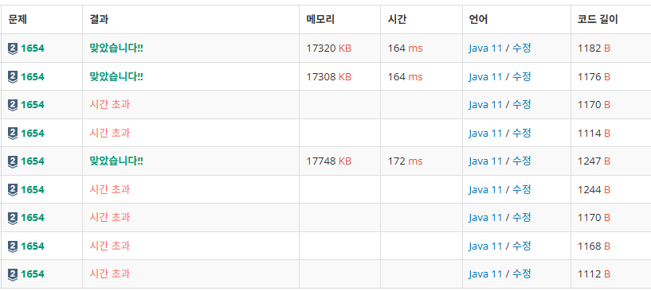

## **결론 : overflow 생각하기**

조건을 확인하고 평범한 parametric search 라고 생각해서

count()구현만 하는 걸 생각했음.

저렇게 해도 10000 * log 1000000 라고 생각해서 절대 시간 초과는 안 된다고 생각하고 시작

결과적으로는 맞았음.

근데 내가 단순히 시간 초과를 해서 최적화를 못 했구나 내 계산이 틀렸구나 라고 생각하고

maxLen 범위나, return 조건 이라던지 추가 했는데 똑같이 시간초과

문제는

    public static int binarySearch(int n, int maxLen) {
    int len = 0;

    int left = 1;
    int right = maxLen;

    while (left <= right) {
      int mid = (right - left) / 2 + left;

      if (count(mid, n) >= n) {
        left = mid + 1;
        len = mid;
      } else {
        right = mid - 1;
      }
    }

    return len;

overflow 처리를 했다고 생각한 int mid 가 터져버림

나중에 설마 이거 때문이라고 하면서 형변환을 했더니 solve

O(n)에 대한 믿음을 가지고 다른 조건을 찾아낼 수 있어야 할 것 같음.
